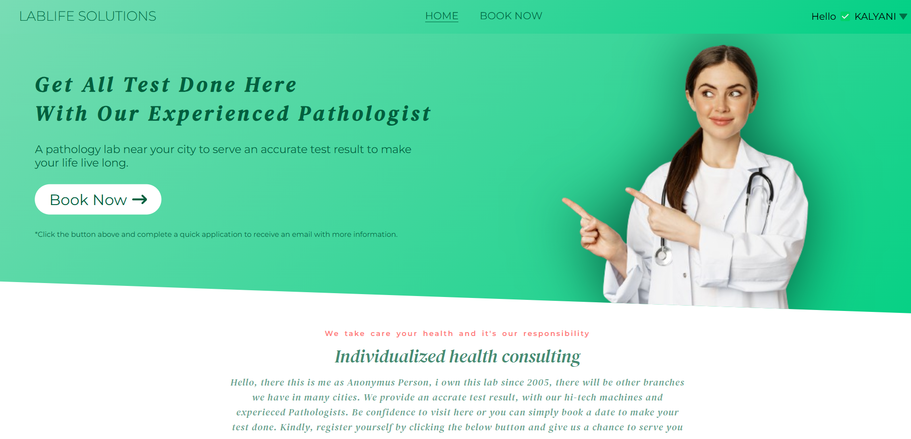
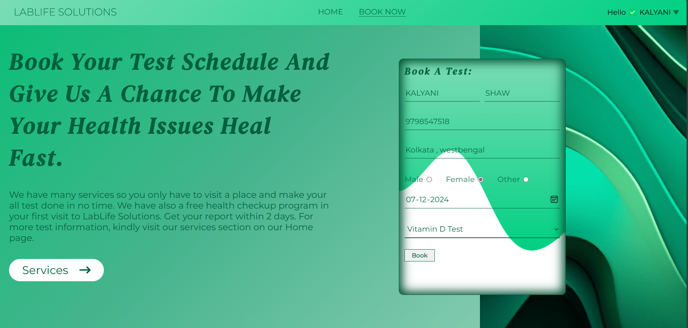
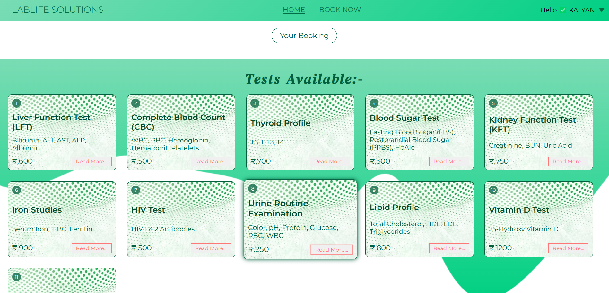

# pathology-lab-website

Description of your project:-

## Table of Contents
- [About](#about)
- [Features](#features)
- [Technologies Used](#technologies-used)
- [Setup](#setup)
- [Usage](#usage)
- [Screenshots](#screenshots)
- [License](#license)
- [Contributing](#contributing)
- [Contact](#contact)

## About
This is a pathology lab website designed to manage lab services, test bookings, and patient reports efficiently.

## Features
- Online test booking system
- Patient report tracking
- Admin dashboard for lab management
- Responsive design for all devices

## Technologies Used
- Frontend: HTML, CSS, JavaScript
- Backend: Node.js, Express.js
- Database: MongoDB
- Framework: React (if applicable)

## Setup
Instructions on how to set up the project locally:
1. Clone the repository:
  git clone https://github.com/kalyanishaw88/pathology-lab-website.git
2. Navigate to the Project Directory:
   cd pathology-lab-website
3.Install backend dependencies:
  cd backend
  npm install
4.Install frontend dependencies:
  cd ../frontend
  npm install
5.Set Up Environment Variables
  PORT=5000
  MONGO_URI=mongodb://localhost:27017/pathology-lab
  JWT_SECRET=your_jwt_secret
6.Start MongoDB
  mongod
7.Run the Backend Server
  npm run server
8.Run the Frontend
  npm start
9.Access the Application
  http://localhost:5000

## Usage
Visit the homepage to browse services.
Book a test using the online booking form.
Log in to view test results and reports.

## Screenshots
 ### Homepage
 
 ### Booknowpage
 
 ### Booknowpage
 

##License
This project is licensed under the ISC License.

# Contributing

I appreciate your interest in contributing to this project! Please follow these steps to contribute:

1. Fork and clone the repository.
2. Create a new branch for your feature (`git checkout -b feature-name`).
3. Make your changes and test them.
4. Commit your changes with a descriptive message.
5. Push the changes and create a pull request.
For detailed guidelines, see the [CONTRIBUTING.md](CONTRIBUTING.md) file.

##Contact
Email: kalyanishaw88@gmail.com
GitHub: kalyanishaw88

  
